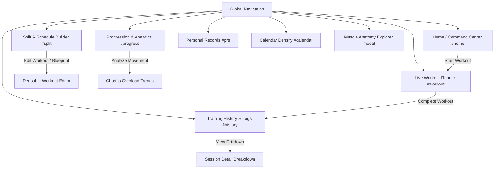

# CalistheniX — Application Flow & User Experience Architecture

An interactive, local-first progressive overload and biomechanics tracking ecosystem built specifically for calisthenics athletes and gymnastic strength enthusiasts.

---

## 1. System Architecture & Global Navigation

CalistheniX operates as a responsive single-page progressive web application (PWA) with a local-first SQLite backend. The interface is optimized for rapid gym-floor logging, real-time isometric timing, high-resolution muscle anatomy visualization, and data-driven progressive overload analytics.

---

## 2. Comprehensive Application Flows & Screens

### Flow 1: Main Command Center (Dashboard & Daily Briefing)
**Route**: `http://localhost:8080/#home`

The athlete's home dashboard serves as the central command hub. It instantly resolves the active training split, calculates weekly workout adherence, displays consecutive daily streaks, and previews today's scheduled movements alongside a real-time anterior and posterior muscle activation map.

#### Key UI Elements:
- **Hero Workout Banner**: Displays the active split name (*Push Pull Legs PPL*), workout title (*Pull B*), total movements (15), sets count (28), and estimated completion duration (~42 min).
- **Session Directives**: Cadence cues (e.g. *3s eccentric tempo on compounds*) and target exertion (*RPE 8.0*).
- **Movement Routine Queue**: Step-by-step numbered exercise list with targets (reps / hold seconds) and inter-set rest intervals.
- **Dual Vector Muscle Focus**: High-precision anterior (front) and posterior (back) anatomical figures highlighting targeted muscle groups in coral red and amber.
- **Weekly Adherence & Consistency**: Visual 7-day progress bar, current streak counter, and aggregate weekly volume (total sets, training tonnage in kg, average pacing).

---

### Flow 2: Live Workout Runner & Exercise Spotlight
**Route**: `http://localhost:8080/#workout`

The active workout runner is tailored for zero-friction mobile and desktop execution during strenuous training. It maintains a sticky session stopwatch, audio cues for hold and rest countdowns, and dynamic stage toggles between stick-figure movement kinematics and real-time anatomical muscle spotlights.

#### Motion & Form Stage:

#### Dynamic Muscle Activation Stage:

#### Runner Features & User Actions:
1. **Live Session Stopwatch**: Persistent elapsed training timer with pause/resume controls.
2. **Kinematic Stage**: Animated SVG stick-figure rendering the dynamic range of motion (eccentric to concentric) for the active movement.
3. **Muscle Stage**: Instant vector body diagram highlighting primary targets (coral red `#ef4444`) and secondary stabilizers (warm gold `#f59e0b`).
4. **Target vs. Actual Input Steppers**: Large, high-contrast rep/second adjustments with "Same as last" quick-fill.
5. **Phase Transitions**: Seamless progression through *Warm-up (Prep)* &rarr; *Main Workout (Training)* &rarr; *Cool-down (Recovery)*.
6. **Rest Interval Countdown**: Automated timer with vibration and audio beeps signaling the next set.

---

### Flow 3: 7-Day Weekly Training Split & Schedule Planner
**Route**: `http://localhost:8080/#split`

Allows athletes to structure and customize their training week from Monday through Sunday, assigning modular workouts or rest days with one tap.

#### Features:
- **7-Day Interactive Grid**: Monday–Sunday layout showing assigned routines (Push A, Pull A, Legs A, Push B, Pull B, Legs B, Rest).
- **Day Editor Modal**: Quick re-assignment of workout templates or toggle between Workout and Rest Day.
- **Multiple Split Profiles**: Switch between different seasonal splits (e.g. *Push-Pull-Legs*, *Upper-Lower*, *Full-Body Skill*).

---

### Flow 4: Reusable Workouts Catalog & Blueprint Editor
**Route**: `http://localhost:8080/#split` (Reusable Workouts Tab)

A modular workout blueprint library where users can create, edit, duplicate, and test-run structured training routines.

#### Blueprint Capabilities:
- **Tri-Phase Architecture**: Categorizes exercises into Warm-up Prep, Main Training, and Cool-down Recovery.
- **One-Tap Actions**: *Edit*, *Duplicate* (creates an isolated clone), and *Test Run* (launches instant runner).
- **Exercise Slot Configuration**: Set-level adjustments, rep targets, isometric hold durations, rest periods, and tempo cadences.

---

### Flow 5: Training History & Completed Session Feed
**Route**: `http://localhost:8080/#history`

A chronological timeline feed of all completed workouts, detailing duration breakdowns, set completion ratios, and tri-phase status.

#### Feed Metadata:
- **Phase Completion Badges**: Green checkmarks indicating completed Warm-up Prep (`Prep 2m`) and Cool-down Recovery (`Recover 2m`).
- **Session Duration Metrics**: Total elapsed time, dedicated training time, and completed vs total sets.
- **Direct Drilldown**: Clicking any session card opens the immutable execution breakdown.

---

### Flow 6: Completed Session Deep-Dive & Set Logs
**Route**: `http://localhost:8080/#session-<uuid>`

An immutable snapshot of a completed workout session, grouping performance by phase and displaying exact reps, hold seconds, load (+kg), and athlete RPE ratings.

---

### Flow 7: Progressive Overload & Analytics Hub
**Route**: `http://localhost:8080/#progress`

Visualizes performance progression over time using interactive Chart.js trend curves, calculates 4-week percentage deltas, and generates natural-language coaching insights.

#### Analytics Modules:
- **Exercise Selector**: Dropdown to switch between any rep-based or isometric hold movement.
- **Explainable Insight Banner**: AI-style natural language feedback (e.g. *"Great progress! Your best performance improved by +33% over the last 2 weeks."*).
- **KPI Stat Cards**: Current best, 2-weeks ago baseline, and 4-week progression percentage.
- **Interactive Trend Line**: Smooth cubic bezier curve with gradient fills and tooltips across training dates.
- **Metric Toggles**: Switch between *Best Set / Best Hold* and *Total Training Volume*.

---

### Flow 8: All-Time Personal Records (PR) Leaderboard
**Route**: `http://localhost:8080/#prs`

Tracks an athlete's personal bests across rep maximums, longest isometric holds, and heaviest added loads.

#### Leaderboard Features:
- **Top Summary Cards**: Total PR count, Max Rep Record, Longest Static Hold, and Top Added Load.
- **Filter Tabs**: *All Records*, *Rep Records*, *Static Holds*, *Weighted (+Kg)*.
- **Quick Actions**: One-tap navigation to view historical trend charts or log new sets directly.

---

### Flow 9: Medical-Grade Vector Muscle Anatomy Explorer
**Trigger**: Available in Settings or clicking *Guide* on any muscle card.

An interactive biomechanics and anatomy explorer mapped on scalable vector coordinates with discrete muscle path selection.

#### Anatomy Features:
- **Interactive Vector Diagrams**: Anterior (Front) and Posterior (Back) athletic models with click-to-select muscle highlighting.
- **Filter Chips**: Upper Body, Core, Lower Body, and discrete muscle groups (Chest, Front Delts, Side Delts, Rear Delts, Biceps, Triceps, Lats, Traps, Abs, Obliques, Quads, Hamstrings, Calves).
- **Mind-Muscle Cues**: Specific neuromuscular cues for strict calisthenics form.
- **Targeting Exercise Database**: Live directory of all catalog exercises activating the chosen muscle group as primary or secondary targets.

---

### Flow 10: 30-Day Training Calendar & Volume Density
**Route**: `http://localhost:8080/#calendar`

Provides a month-level overview of workout consistency, scheduled training distribution, and completed sessions.

---

## 3. Data Flow & REST API Contracts

| Route | Method | Purpose | Response Format |
|---|---|---|---|
| `/today` | `GET` | Resolves today's scheduled workout from the active split | `{ date, day_name, split_name, workout: { id, name, exercises: [...] } }` |
| `/splits` | `GET` / `POST` | Fetches all splits or creates a new split profile | `[ { id, name, is_active, schedule: [...] } ]` |
| `/workouts` | `GET` / `POST` | Manages reusable modular workout blueprints | `[ { id, name, warmup_template, cooldown_template, exercises } ]` |
| `/workout_sessions` | `GET` / `POST` | Fetches completed sessions or syncs a finished workout | `{ id, routine_name, duration_sec, warmup_status, cooldown_status, logs }` |
| `/exercises/<id>/logs`| `GET` | Fetches historical log timeline for trend charting | `[ { id, reps, duration_sec, weight_kg, rpe, timestamp } ]` |
| `/dashboard/summary` | `GET` | Retrieves aggregate streak days, weekly volume, and sets | `{ streak_days, week_sessions, week_sets, top_movers }` |
| `/dashboard/records` | `GET` | Retrieves all-time personal records across exercises | `[ { exercise_id, exercise_name, record_type, value, date } ]` |
